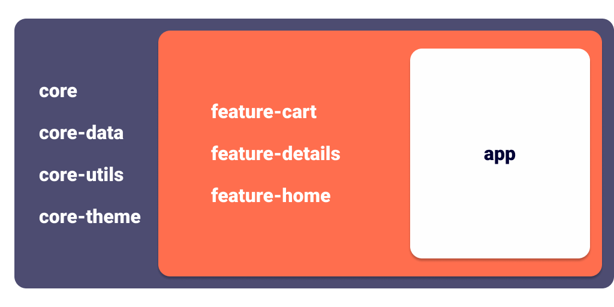

# Test Ecommerce

## Introduction

The project was made as a test task some time ago. The main requirements were making UI (XML) in accordance with the Figma, code extensibility and technology stack. The modularization of the application is a mandatory requirement. For this reason, the current project echoes [Fitness Assistant](https://github.com/r-khvstnv/WorkoutApp). If you want to see this architecture with local database implementation please check [that repository](https://github.com/r-khvstnv/WorkoutApp).
  

## Previews

---
  

## Technology Overview
### Modules structure

- __core__ - Elements and Technological Solutions specific only to this project;
- __core-data__ - General Data and Domain layers expandable by modules;
- __core-theme__ - Application Theme and XML styles. The module is implemented by __core__. It simplifies interaction with it since __core__ is known to everyone higher in the hierarchy of modules;
- __core-utils__ - Contains methods that can be used in every Android project regardless of its _context_;
- __feature-N__ - Functional part of the Application.
    

### Architecture  Diagram

#### Key points:
__Data Layer__ is internal and ___not visible outside of core-data module___. It helps to make an application more flexible and prevents depending on incoming data. This concept are ___satisfied by mappers___. They convert the data layer's models to the required models. Moreover, a user will receive only the required piece of data instead of all possible (Example: Cart module, ~Local source).

__MockDatabase__ is carried out by ___Shared Preferences___. Full local database implementation in this case is redundant. That is why ProductInCartDto, Gson and MockDatabase have this kind of connection on the graph. They are stubs.

__MyResult__ is a sealed class that helps to collect complex data, where errors or exceptions may be received too.

__DisplayableItem__ is an indicator. The interface should be inherited by used models in the AdapterDelegate. AdapterDelegate is mandatory for implementation.
  

### Dagger Dependency Graph

__ViewModelFactoryModule__ is added in each required Dagger Module separately. It helps to limit the visibility of each ViewModel per library module.

__Internal__ realisation of __Feature Components/Modules__ ___prevents___ other library classes from ___disclosing___. Same case with __Source and Data modules__.

---
  

## Technology Stack
- __Clean Architecture*__
- __Multi module*__
- __MVVM*__
- __Kotlin__
- __Jetpack__
  - Lifecycles
  - Coroutines*
  - LiveData*
  - ViewModel
  - Navigation Component
- __AdapterDelegates*__
- __Dagger2*__
  - Multibinding
  - Scopes
- __Retrofit2__
- __Glide__

__(*)__ - _Recommended technology stack_